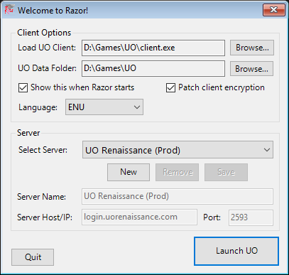

# Razor

Razor, UO:Renaissance Community Edition *(UOR:CE)*, is a free tool designed to help with simple tasks while playing Ultima Online.

For more information about this version of Razor, the history, release notes and downloads links please visit [http://www.uor-razor.com](http://www.uor-razor.com)

## Installing Razor

First, [download Razor](http://www.uor-razor.com/#download). Unlike previous versions of Razor, this version doesn't use the Windows Registry or `%AppData%\Razor` to store configuration, macros and profiles. In other words, *it's portable*. To install, follow these simple steps:

* Download the latest release of Razor at [the main site](http://www.uor-razor.com).
* Extract the zip into any location (ie: `C:\UO\Razor`)
* **(Optional)** If you have an existing version of Razor, copy the Profiles and Macros folders from `%AppData%\Razor` into the folder you extracted the zip above to. If you have custom counters, also copy `counters.xml` over.

> ***Note:** All macros should work from previous version, with the exception of macros using targeting created in Razor 1.0.14.x. You will need to re-add those target hotkeys to your macros.*

* Right-click on the Razor shortcut or Razor.exe, go to Properties. On the Compatibility tab, select **Run this program in compatibility mode** for and select **Windows XP SP2**. Also select **Run this program as an administrator**
* Run Razor either via the shortcut or clicking the Razor.exe directly.
* Razor should prompt to **Run As Administrator**. You must allow this for Razor to function correctly.

## Upgrading Razor

Since Razor is portable, upgrading it is a copy/paste exercise.

* Download the latest release of Razor at [the main site](http://www.uor-razor.com).
* Extract the zip into your existing Razor location (ie: `C:\UO\Razor`), overwritting all files, with the exception of two:
    * **counters.xml** - This is the default counters file used to display items in your titlebar. If you've added any new counters, they would be lost if overwritten.
    * **Razor.exe.Config** - This is the config file that stores your UO path, server list, etc. Copying this over will overwrite those settings.
* Open Razor back up and log back in.

## Welcome Screen

The first time you run Razor, it will open with a **Welcome Screen** and give you an option to import your exising



Browse to your `client.exe` that you want to run along with Razor. Set the **UO Data Directory** (most likely the same path as your `client.exe`). Either use the pre-configured servers or enter your own server in the list here.

You can also edit `Razor.exe.Config` and add your own servers or just enter the server name and port in this format: `server.name.com,port`

Click **OK** to open Razor and Ultima Online.

## Configuration File

The **Welcome Screen** will control some of these settings, but some settings can only be changed by editing `.\Razor.exe.config`.

```xml 
<appSettings>
    <add key="PatchEncy" value="1" /> <!-- Patch client encryption -->
    <add key="ServerEnc" value="0" /> <!-- Use OSI encryption -->
    <add key="MaxOrganizerAgents" value="20" /> <!-- Override the default Organizer agent count -->
    <add key="MaxBuyAgents" value="10" /> <!-- Override the default Buy agent count -->
    <add key="MaxRestockAgents" value="10" /> <!-- Override the default Restock agent count -->
    <add key="ImportProfilesAndMacros" value="false" />  <!-- If true, will import macros and profiles from %AppData%\Razor -->
    <add key="LastProfile" value="Test" /> <!-- Last profile used in Razor -->
    <add key="LastServer" value="test.uorenaissance.com" /> <!-- Last server connected to in Razor -->
    <add key="LastPort" value="2597" /> <!-- Last server port connected to in Razor -->
    <add key="LastServerId" value="1" /> <!-- Index of the server selected in the dropdown -->
    <add key="ShowWelcome" value="1" /> <!-- Show the Welcome Screen when loading Razor -->
    <add key="UOClient" value="D:\Games\UO\client.exe" /> <!-- Location to Ultima Online client -->
    <add key="UODataDir" value="D:\Games\UO" /> <!-- Location to Ultima Online data directory -->
</appSettings>

<!-- You can define a list of servers here by adding values between <Servers></Servers> -->
<Servers>
    <add key="Custom Server" value="server.someserver.com,2593" />
</Servers>
```

## About This Documentation

The documentation found here is an aggregation of data and resources gathered across the Internet including [UO:Renaissance's Guide to Razor](http://uorforum.com/threads/renaissance-guide-to-razor.3671/).

This documentation will give you a general overview of Razor and how to use it. If any information is missing or incorrect, please contact me.